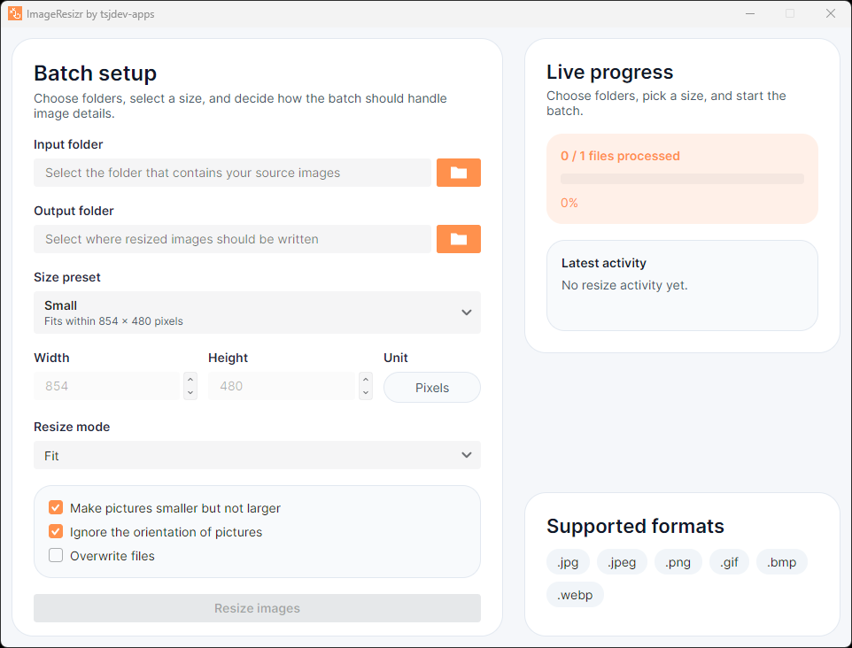
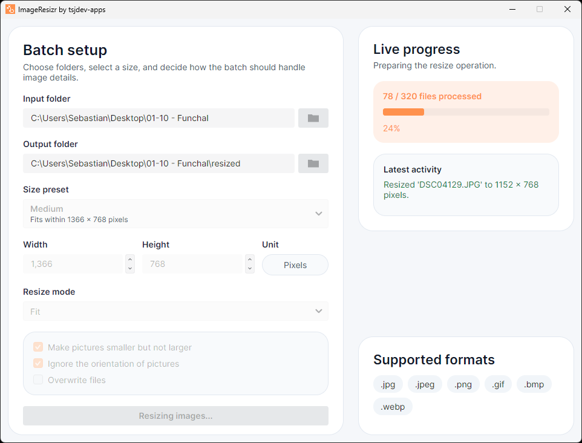
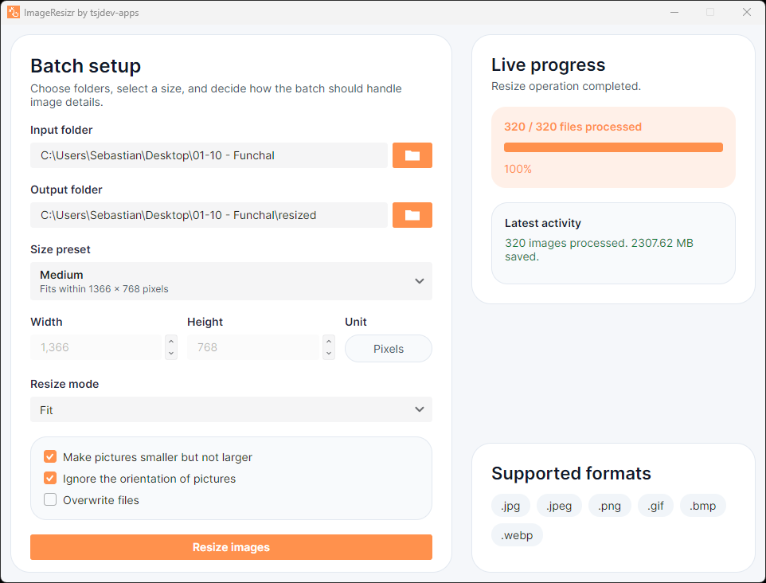

# Image Resizr

Image Resizr is a cross-platform desktop app for resizing entire folders of images without turning the task into a script. Built with Avalonia on .NET, it focuses on a practical batch workflow: choose a source folder, pick a preset or custom size, decide how the image should fit the target bounds, and export a resized set with live progress feedback.


The project is aimed at everyday image-processing jobs such as preparing lighter photo folders, generating web-ready assets, creating preview copies, or reducing large batches before sharing them.

## Highlights

- Batch resize supported images from a desktop UI
- Preserve original file names and output formats
- Choose between `Fit`, `Fill`, and `Stretch` resize modes
- Use built-in presets or define custom pixel dimensions
- Prevent upscaling with the `Shrink only` option
- Respect or ignore EXIF orientation metadata
- Skip or overwrite existing files with safe temporary-file writes
- Track progress through live status updates and completion summaries
- Support `.jpg`, `.jpeg`, `.png`, `.gif`, `.bmp`, and `.webp`

> Note: the current resize workflow processes files from the selected input folder only. It does not recurse into nested subfolders.

## Screenshots

### Batch setup



The main screen keeps the workflow simple: select an input folder, choose an output folder, apply a preset or custom size, and control how the batch should treat orientation, overwrites, and upscaling.

### Live progress during a running batch



While the batch is running, ImageResizr shows overall progress, the latest file activity, and a clear status message so you can see what the app is doing at a glance.

### Completion summary



After the batch finishes, the same workspace shows the final summary, including processed files and saved space, without forcing you into a separate report view.

## Resize Workflow

1. Select the folder that contains the source images.
2. Choose where the resized copies should be written.
3. Pick a preset or switch to a custom size.
4. Select the resize mode: `Fit` keeps the full image inside the target bounds, `Fill` fills the target bounds and crops as needed, and `Stretch` forces the exact size.
5. Decide whether to avoid enlarging smaller images, ignore EXIF orientation, or overwrite existing files.
6. Start the batch and follow the live progress panel.

## Built-in Presets

- `Small`: fits within `854 x 480`
- `Medium`: fits within `1366 x 768`
- `Large`: fits within `1920 x 1080`
- `Phone`: fits within `320 x 568`
- `Custom`: lets you enter your own pixel dimensions

## Supported Formats

Image Resizr currently works with the following file types:

- `.jpg`
- `.jpeg`
- `.png`
- `.gif`
- `.bmp`
- `.webp`

The service keeps the original file extension and writes resized output with the same format family. Animated `.gif` and `.webp` files are processed as still images, so only the first frame is used in the resized output.

## Getting Started

### Prerequisites

- .NET SDK matching the version pinned in `global.json`

### Restore

```bash
dotnet restore ImageResizr.slnx
```

### Build

```bash
dotnet build ImageResizr.slnx --configuration Release
```

### Run the desktop app

```bash
dotnet run --project src/ImageResizr.App/ImageResizr.App.csproj --configuration Release
```

### Run the tests

```bash
dotnet test ImageResizr.slnx --configuration Release
```

There is no separate lint command. Repository analyzers and code-style checks run as part of the build.

## Project Structure

- `src/ImageResizr.App`: Avalonia desktop UI shell
- `src/ImageResizr.Core`: resize pipeline, models, and file/image processing
- `tests/ImageResizr.Tests`: xUnit tests for the service and the view model

The solution intentionally keeps the UI thin. Avalonia-specific code lives in the app project, while the resize workflow, validation, format handling, and progress reporting live in the core library.

## Tech Stack

- [.NET](https://dotnet.microsoft.com/)
- [Avalonia UI](https://avaloniaui.net/)
- [CommunityToolkit.Mvvm](https://learn.microsoft.com/dotnet/communitytoolkit/mvvm/)
- [SkiaSharp](https://github.com/mono/SkiaSharp)
- [xUnit](https://xunit.net/)

## Quality

The repository includes automated coverage for both the batch resize service and the window view model. Tests verify resize behavior, file handling, overwrite rules, shrink-only logic, progress reporting, and completion-state behavior.

## License

This project is licensed under the MIT License. See [LICENSE](LICENSE) for details.
